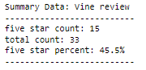
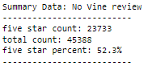

# Amazon_Vine_Analysis

## Overview

### The Data
We were tasked with examining data for amazon reviews of apparel products. The data collected my a large set with thousands of entries for various products purchased and reviewed by users. The dataset included variables for customer id, product information, product ratings, whether or not the transaction was part of the vine program, the date of the review, and number of positive reviews. The purpose of the analysis is to determine the benefits of participating in Amazon's vine program. 

### ETL
As part of the analysis, we used python pyspark to perform our extract, transform, load (ETL) process. The data was extracted directly from Amazon's website using pyspark and transformed into dataframes that could be stored in a relational database instance hosted by Amazon web services (AWS).  Pyspark was essential in organizing the data into 4 dataframes that it could be accomodated by a postgreSQL database.  Our AWS relational database was connected to PGAdmin and the data was transferred through the hosted instance to PGAdmin. the tables in PGAdmin were then exported to a CSV file that could then be able to be read and analyzed via the pandas library in python. 

## Results

- Vine and Non-Vine Reviews: Overall, there were many more non-vine reviews (45,388) compared to vine reviews (33). 
- Five-Star Reviews - Given the size of each data set, there were a corresponding number of 5-star reviews (15 and 23,733 vine and non-vine reviews, respectively)
- % of Five-star - Roughly 45% of vine reviews were 5-star while 52.3% of non-vine reviews were 5-star. 

## Summary

Overall, there does not appear to be any visually obervable bias given the parameters of the current analysis.  Although vine reviews for apparel items have many less observations that do non-vine reviews, the % of positive reviews in each case are reasonably close to one another.  In fact, our results tend to support the notion that the vine reviews were less biased than the non-vine reviews. However, given the thin number of observations for vine-reviewed purchases, one should be wary of drawing statistical inference from that dataset. One suggestion for further research would be to perform a multivariate regression focusing on the statistical signifcance and yielded estimator of the binary variable indicating a review was in the vine program or not. the regression would give us insight into as to whether the vine program was a significant determinant of the relative postivity of a vine review. 

